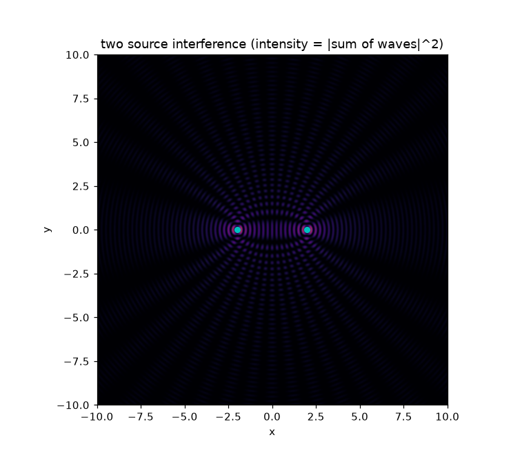

# python-junk

teaching myself to simulate physics in python. started with a projectile that just falls and i'm slowly working my way up. the hard part is never the physics, its the numbers -- stepping time without it blowing up.

its called junk for a reason. there's a `scratch/` folder that's pure chaos and at least two files that do almost the same thing.

## stuff so far
- **projectile motion** -- euler by hand, with and without air drag
- **oscillators** -- spring, pendulum (small angle vs full nonlinear), damped + driven, resonance. then i reorganized into `oscillators/` and left half of it in `damped/`, oops
- **euler vs rk4** -- euler leaks energy, rk4 fixes it. this lesson keeps coming back
- **numerical methods** -- bisection, newton, trapezoid/simpson, all hand-rolled
- **randomness** -- 1d/2d random walks (they spread like sqrt(N)!), monte carlo pi
- **waves + fourier** -- this is where my optics class snuck in. interference, the double slit (did it wrong once then right), FFT to pull tones out of noise, gaussian beams and the fresnel equations (brewster angle!)

## a couple results

the double slit, done properly -- fast fringes under the slow diffraction envelope:

two point sources interfering (intensity = |sum of the waves|squared):

## next
n-body gravity (planets!), and the heat equation, which i keep breaking
