# python-junk

~four years of teaching myself to simulate physics in python. it started as a projectile that just falls and ended up at the schrodinger equation. the whole way through, the hard part was never the physics -- it was the *numbers*. how do you step time forward without the sim blowing up? that one question basically taught me numerical methods.

still junk, still mine (the name was a warning, not a typo). i build the math to actually understand it.

 you can actually run the notebooks in your browser, no install, thanks to binder. (and `notes-to-self.md` has my cheatsheet for exporting gifs, git, all that.)

## the gallery

<table>
<tr>
  <td align="center">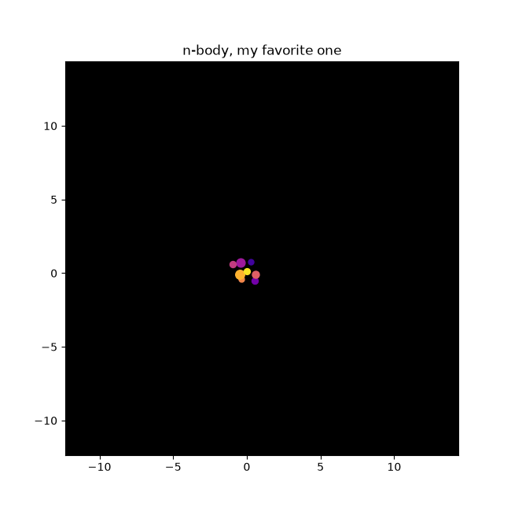 <b><a href="mechanics/nbody.py">n-body gravity</a></b> softened + vectorized, my favorite</td>
  <td align="center">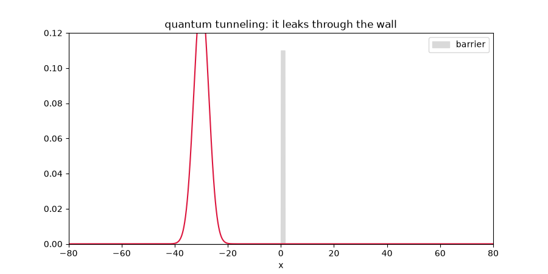 <b><a href="quantum/tunneling.py">quantum tunneling</a></b> it leaks through the wall</td>
  <td align="center">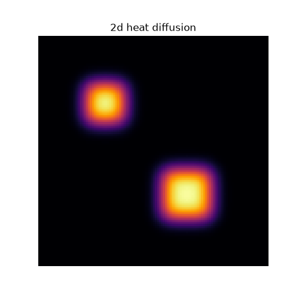 <b><a href="pde/heat2d.py">2d heat diffusion</a></b></td>
</tr>
<tr>
  <td align="center">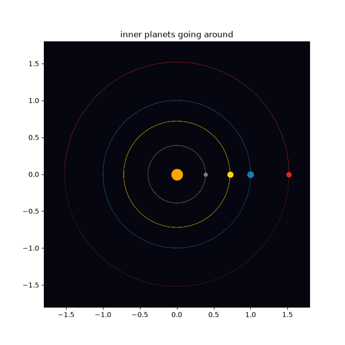 <b><a href="mechanics/solar_system.py">toy solar system</a></b></td>
  <td align="center">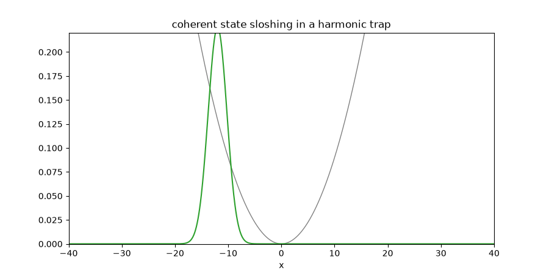 <b><a href="quantum/qho_animate.py">coherent state</a></b> sloshing in a trap</td>
  <td align="center">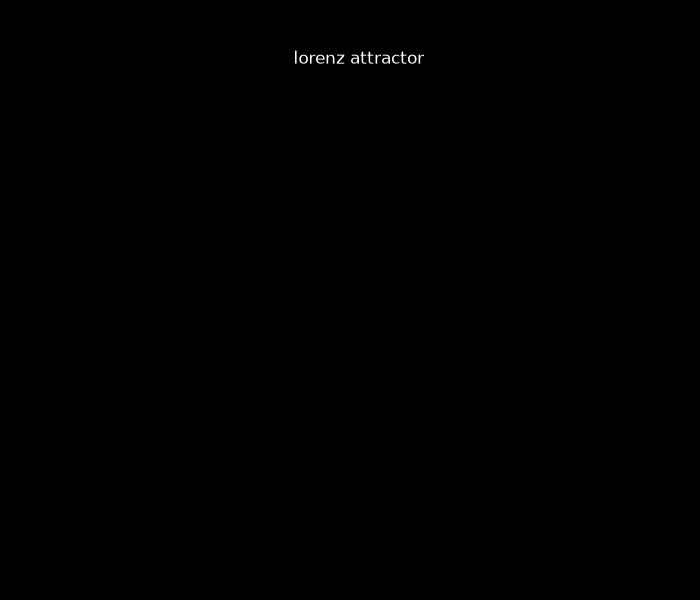 <b><a href="lorenz.py">lorenz attractor</a></b></td>
</tr>
<tr>
  <td align="center">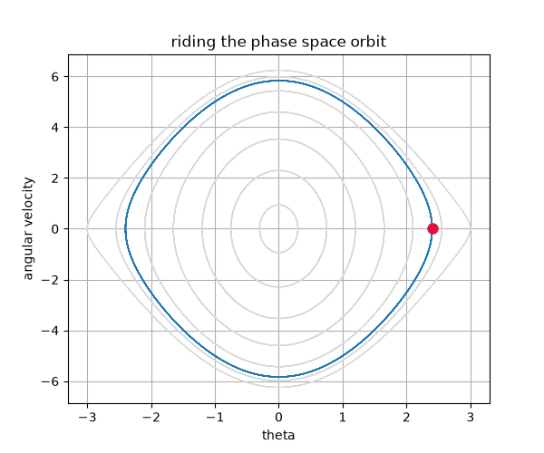 <b><a href="oscillators/phase_space.py">pendulum phase space</a></b></td>
  <td align="center">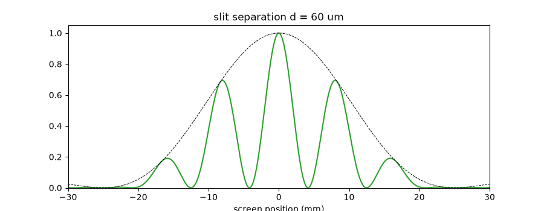 <b><a href="notebooks/wave_playground.ipynb">interference, from a notebook</a></b> dragging the slits live</td>
  <td align="center">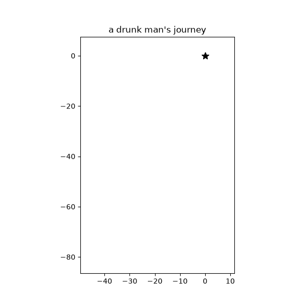 <b><a href="random_walk_2d.py">2d random walk</a></b></td>
</tr>
</table>

a few static ones i'm still fond of -- the double slit and the harmonic-oscillator ladder:

<a href="waves/double_slit.py">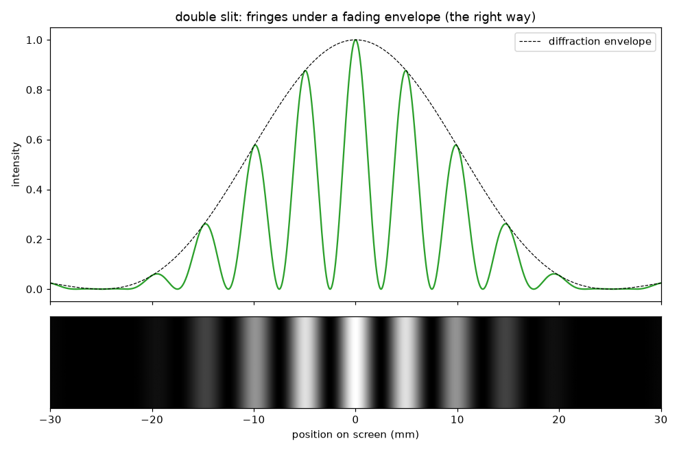</a>
<a href="quantum/sho_eigenstates.py">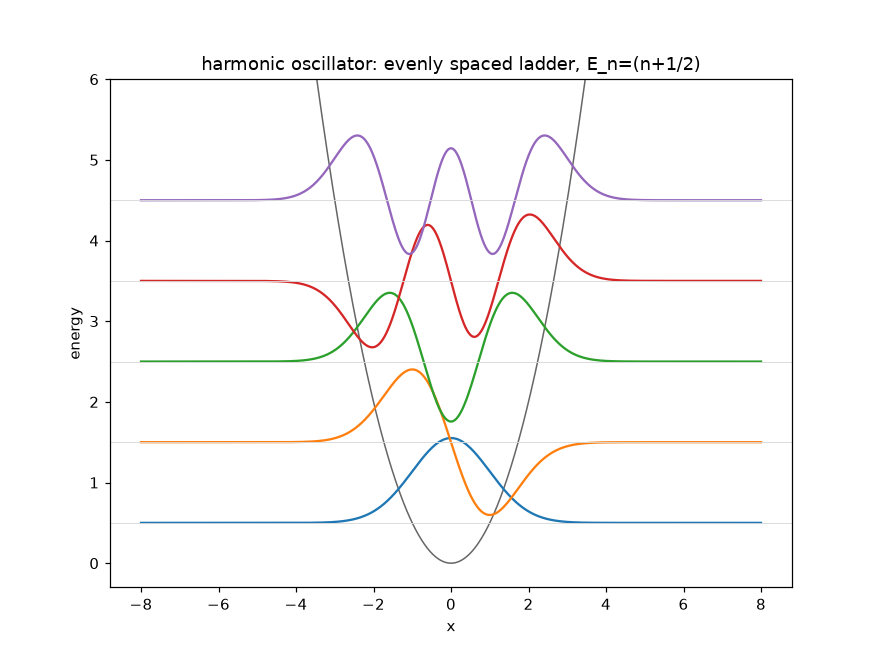</a>

## the arc (roughly chronological)
mechanics -> oscillators -> numerical methods (euler vs rk4) -> randomness -> waves & fourier -> n-body gravity -> PDEs (heat, wave, poisson) -> animation -> interactive notebooks -> quantum.

each folder is a little era. you can kind of watch my code grow up if you read it in order -- the early stuff is all explicit `for` loops and hardcoded constants and comments where i'm explaining things to myself; the later stuff vectorizes and actually has docstrings.

## what i actually learned
- **euler will betray you.** it quietly pumps energy into your system. rk4, leapfrog, or just check conservation.
- **stability has a speed limit.** crank `dt` too high and explicit heat/wave sims go to
`nan`. that's CFL, not a bug. (`pde/stability_note.md` is me learning this the hard way.)
- **the FFT is everywhere.** once the DFT clicked, waves and signals and the split-step quantum solver all turned into the same handful of ideas.
- the **split-step fourier** method i used for the wavepacket (`quantum/split_step.py`) is the thing im most proud of here. you handle the kinetic part in fourier space and the potential part in real space and just leapfrog between them. its the same skeleton you'd use for nonlinear optics / a fiber pulse solver, which is exactly where i want to take this next. from wave equations toward real hardware.

## the mess (on purpose)
- `scratch/` -- a junk drawer i never cleaned. there's an `old_pendulum.py` in there thats worse than the real one. kept it.
- `waves/doubleslit.py` AND `waves/double_slit.py` -- the first is wrong (forgot the diffraction envelope), kept both as a before/after.
- `damped/driven.py` -- orphaned when i reorganized into `oscillators/` and never finished moving things.
- naming is inconsistent (`randomwalk.py` vs `random_walk_2d.py`). i know. leaving it (≧◡≦)

that's what learning actually looks like. not a clean repo, just a pile of attempts that slowly got less wrong. anyway, poke around (°◡°♡)
